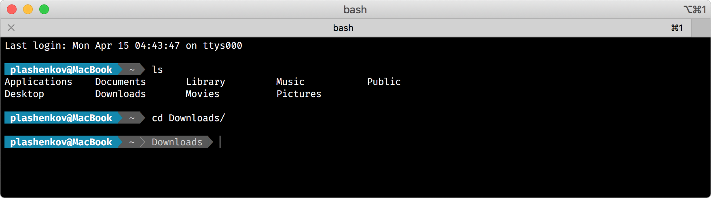

# Powerline

Beautiful powerline-style prompt written in pure bash, simple and very fast.

## Features

Prints username and current path. Too long path is shortened.



## How to use

Include powerline.sh in `.bash_profile` or `.bashrc` file:

```bash
source "/path/to/powerline.sh"
```

That's all!

## Credits

[Yury Plashenkov](https://github.com/plashenkov)

## License

This script is licensed under the [MIT license](LICENSE.md).
